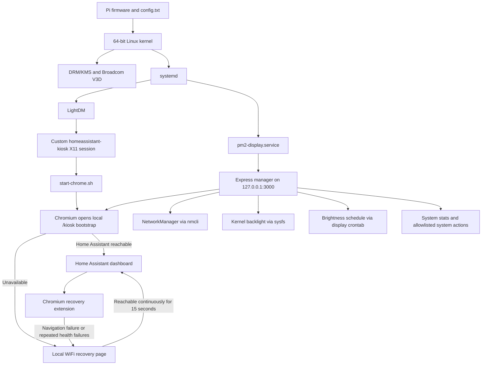

# Raspberry Pi Kiosk System Architecture

This document describes the deployed architecture of the wall-mounted Home Assistant kiosk on `pi-hallway-display`, with particular attention to the choices made for smooth rendering, low touch latency, and reliable unattended operation.

The configuration was verified on July 18, 2026. It describes the running system, not a generic Raspberry Pi recipe.

## System at a glance

| Component | Deployed configuration |
| --- | --- |
| Computer | Raspberry Pi 4 Model B Rev 1.5, 4 GB RAM |
| Display | Raspberry Pi Touch Display 2, native 720×1280 at 60 Hz |
| Kiosk orientation | 1280×720 landscape, DSI display rotated left |
| Operating system | 64-bit Debian 13 (Trixie) |
| Graphics stack | DRM/KMS, Mesa, Broadcom V3D, Xorg modesetting driver |
| Session | Minimal custom LightDM/X11 kiosk session; no desktop environment or compositor |
| Browser | Chromium in kiosk mode with GPU rasterization and touch flags |
| Local manager | Node.js, Express 5, vanilla HTML/CSS/JavaScript |
| App supervision | PM2 under the dedicated `display` user |
| Networking | NetworkManager and `nmcli` |
| Local manager address | `http://127.0.0.1:3000` only |

## Boot and runtime flow



Two independent boot paths meet at the local bootstrap page:

1. `lightdm.service` starts the graphical kiosk session.
2. `pm2-display.service` resurrects the local Express manager.
3. Chromium opens `http://127.0.0.1:3000/kiosk`, never Home Assistant directly.
4. The bootstrap checks Home Assistant through the local manager and selects either the dashboard or the offline WiFi page.

This prevents Chromium's built-in failed-load page from becoming the only available interface after an offline boot.

## Performance-critical configuration

### 1. Full KMS and real V3D hardware acceleration

`/boot/firmware/config.txt` enables the modern DRM/KMS graphics stack:

```ini
dtoverlay=vc4-kms-v3d
max_framebuffers=2
disable_fw_kms_setup=1
arm_64bit=1
```

The Touch Display 2 is configured as a 60 Hz DSI output:

```ini
video=DSI-1:720x1280@60,rotate=270
dtoverlay=vc4-kms-dsi-ili9881-7inch,rotation=270
```

Xorg uses the `modesetting` driver against the DRM device. The running system reports:

- direct rendering: enabled;
- renderer: Broadcom V3D 4.2;
- Mesa hardware acceleration: enabled;
- active output: `DSI-1`, 1280×720 at approximately 60 Hz.

This is the most important rendering requirement. Chromium should not be allowed to fall back to CPU software rendering.

### 2. Minimal X11 session

LightDM automatically signs in the dedicated `display` user and starts the `homeassistant-kiosk` session:

```ini
[Seat:*]
autologin-user=display
autologin-session=homeassistant-kiosk
user-session=homeassistant-kiosk
```

`/usr/share/xsessions/homeassistant-kiosk.desktop` launches `/home/display/start-chrome.sh` directly. The running graphical session contains Xorg and Chromium, with no desktop shell, panel, general-purpose window manager, or separate compositor.

Removing a full desktop environment reduces memory use, background CPU activity, context switching, and additional composition passes. Chromium remains responsible for compositing its own page.

The current system intentionally uses X11 because its DSI rotation, libinput calibration, and kiosk startup path are proven on this device. Wayland is not currently part of the deployed architecture. A Wayland migration should be benchmarked as a complete session change rather than treated as a single browser flag.

### 3. Fixed native-size browser surface

`/home/display/start-chrome.sh` rotates the portrait-native DSI panel into landscape before starting Chromium, then fixes the browser to the physical kiosk surface:

```text
--window-size=1280,720
--window-position=0,0
--start-maximized
--force-device-scale-factor=1.0
```

The script does not repeatedly auto-detect geometry because XRandR reports portrait dimensions during parts of the rotation sequence. A fixed 1280×720 surface avoids accidental oversized rendering, rescaling, and layout churn.

The touchscreen calibration matrix in `/etc/X11/xorg.conf.d/40-libinput.conf` applies the same rotation to touch coordinates.

### 4. Chromium GPU and kiosk flags

The launcher prefers `/usr/lib/chromium/chromium` directly instead of the distribution wrapper. This keeps the kiosk's flags explicit and avoids wrapper-added behavior that is unnecessary for this dedicated session.

The core rendering flags are:

```text
--ignore-gpu-blocklist
--use-gl=angle
--use-angle=gles
--enable-gpu-rasterization
--force-device-scale-factor=1.0
```

The running Chromium GPU process confirms `--use-angle=gles` and GPU rasterization. Touch handling is enabled explicitly with `--touch-events=enabled` and `--enable-touch-drag-drop`.

Unneeded browser services are reduced with flags including:

```text
--disable-background-networking
--disable-client-side-phishing-detection
--disable-default-apps
--disable-sync
--disable-translate
--disable-component-update
--no-first-run
```

`--disable-background-timer-throttling` is also intentional. It allows the kiosk's recovery monitoring to stay prompt even when Chromium changes page visibility state. This favors responsiveness over minimum idle CPU use.

Only the local recovery extension is loaded. Normal extensions are disabled so they cannot add page or background-process overhead.

### 5. CPU, GPU, memory, and storage tuning

The Pi boot configuration contains the following explicit performance settings:

```ini
arm_boost=1
arm_freq=2000
over_voltage=6
gpu_freq=700
gpu_mem=128
```

The CPU uses the `ondemand` governor and can reach the configured 2 GHz maximum. This retains idle down-clocking while allowing quick ramp-up under touch and rendering load.

These frequency and voltage values are an intentional overclock. Stable operation depends on adequate cooling and a reliable power supply. The health check for this installation is:

```sh
vcgencmd get_throttled
vcgencmd measure_temp
```

At verification time, `get_throttled` returned `0x0`, meaning no current or historical under-voltage, frequency capping, or thermal throttling was reported since boot.

The system also provides a 2 GB, priority-100 zram swap device and no SD-card-backed swap. Compressed RAM swap is substantially less disruptive to kiosk responsiveness than synchronous swap traffic to the SD card.

`gpu_mem=128` is retained in the installed configuration, although full KMS allocates modern graphics buffers through the kernel and Mesa; the KMS/V3D driver and confirmed direct rendering are the authoritative acceleration indicators.

### 6. Lightweight local application

The manager deliberately avoids a frontend framework, build system, and client-side dependency bundle. Its three local pages use vanilla HTML, CSS, and JavaScript. The main dashboard avoids expensive animated backgrounds and refreshes general system statistics every 30 seconds rather than continuously.

The Express backend:

- binds to loopback only, avoiding external request load and removing the need for an application authentication layer;
- collects independent system statistics in parallel;
- uses compact native Linux interfaces where possible;
- uses Server-Sent Events only while a system update is being observed;
- validates input before invoking an operating-system command.

PM2 keeps the single Node.js process alive and restores it during boot. The app is intentionally run as the unprivileged `display` user.

## Display behavior and tearing trade-off

The current path is:

```text
Home Assistant DOM → Chromium compositor/GPU rasterizer → ANGLE/GLES → Mesa V3D → DRM/KMS → DSI-1 at 60 Hz
```

Full KMS, direct rendering, a fixed native-size surface, and Chromium's GPU compositor are the active anti-jank measures. There is no separate X11 compositor, which avoids an additional composition pass and its resource cost.

The trade-off is that X11 does not provide the same compositor-wide frame-presentation guarantees as a carefully configured Wayland session. If visible tearing remains after confirming direct rendering and `get_throttled=0x0`, a Wayland kiosk should be tested as an alternative architecture. That test must include DSI rotation, touch calibration, Chromium Ozone support, the recovery extension, and cold-boot reliability before replacing the known-working X11 path.

## Network and offline recovery architecture

NetworkManager owns both Ethernet and WiFi. The local manager calls `/usr/bin/nmcli` to read state, scan networks, and connect `wlan0`.

Recovery happens at three layers:

1. **Cold boot:** `/kiosk` checks Home Assistant before leaving localhost.
2. **Navigation failure:** the Chromium extension listens for recoverable top-level network errors and immediately opens `/wifi?reason=network-error`.
3. **Stale loaded dashboard:** the extension checks `/api/dashboard/status` every 30 seconds. Two consecutive failures are required before it leaves a loaded remote page, preventing a transient timeout from causing unnecessary recovery.

The WiFi page is served locally and therefore remains available without LAN connectivity. It checks network and Home Assistant status every five seconds. Once Home Assistant becomes reachable after an outage, it must remain reachable for 15 seconds before the page automatically returns to the dashboard. Losing reachability cancels and resets that countdown.

WiFi power saving is currently reported as enabled. It was not disabled as part of the performance configuration. If intermittent WiFi latency or disconnects remain a problem, power saving is a separate setting to evaluate and measure; this document should not imply it is already tuned off.

## Manager and privilege boundary

The Express app listens only on `127.0.0.1:3000` and has no login screen. It must not be changed to `0.0.0.0` without first adding authentication and reviewing every privileged route.

Operations requiring root are narrowly allowlisted in `/etc/sudoers.d/display-pi-ha`. The app always calls `sudo -n`, so a missing rule fails immediately instead of freezing the touchscreen while waiting for a password.

Privileged capabilities are limited to:

- package update and upgrade;
- shutdown and reboot;
- restarting LightDM;
- writing the detected backlight brightness;
- NetworkManager operations through `nmcli`.

## Brightness architecture

The current Touch Display 2 exposes `panel_backlight@1` under `/sys/class/backlight` with a raw range of 0–31. The application does not hard-code that device name:

- API operations enumerate `/sys/class/backlight`, read `max_brightness`, and validate writes against the detected range;
- UI values are converted between raw hardware levels and percentages;
- cron entries use `/sys/class/backlight/*/brightness` so schedules survive a kernel device-name change;
- only crontab lines marked `# brightness-schedule` are managed, preserving unrelated user jobs.

Cron owns execution of scheduled changes, so schedules persist independently of the browser and survive reboots.

## Files of record

| File | Responsibility |
| --- | --- |
| `/boot/firmware/config.txt` | KMS, DSI display, rotation, 64-bit mode, CPU/GPU tuning |
| `/boot/firmware/cmdline.txt` | Quiet kiosk boot and console blanking behavior |
| `/etc/X11/xorg.conf.d/99-modesetting.conf` | Xorg KMS/modesetting GPU selection |
| `/etc/X11/xorg.conf.d/40-libinput.conf` | Rotated touchscreen calibration |
| `/etc/lightdm/lightdm.conf` | Automatic login and custom session selection |
| `/usr/share/xsessions/homeassistant-kiosk.desktop` | Minimal kiosk session definition |
| `/home/display/start-chrome.sh` | Rotation, blanking control, Chromium flags, local bootstrap |
| `/etc/systemd/system/pm2-display.service` | Restores the manager process at boot |
| `/home/display/.pm2/` | PM2 state and manager logs |
| `process.json` | Manager script, environment, and Home Assistant target |
| `main.js` | Local HTTP APIs and operating-system integration |
| `public/index.html` | Main management dashboard |
| `public/kiosk.html` | Startup reachability decision |
| `public/wifi.html` | Offline WiFi recovery and 15-second return logic |
| `kiosk-extension/` | Chromium navigation-error and stale-dashboard recovery |
| `/etc/sudoers.d/display-pi-ha` | Non-interactive privilege allowlist |
| `/home/display/sudoers-setup.sh` | Reinstalls the expected sudoers rules |
| `/home/<user>/system_installer/pi4-homeassistant-kiosk-setup.sh` | Rebuild source for the wider Pi kiosk configuration (external to this repo; machine-specific path) |

## Operational checks

Use these checks after a Chromium, kernel, Mesa, display, or boot configuration change:

```sh
# Confirm the local manager and supporting services.
systemctl is-active lightdm NetworkManager cron pm2-display
curl -fsS http://127.0.0.1:3000/api/dashboard/status

# Confirm hardware rendering; renderer must be Broadcom V3D, not llvmpipe.
DISPLAY=:0 XAUTHORITY=/home/display/.Xauthority glxinfo -B

# Confirm the expected 1280×720 DSI output.
DISPLAY=:0 XAUTHORITY=/home/display/.Xauthority xrandr --current

# Confirm power and thermal health.
vcgencmd get_throttled
vcgencmd measure_temp

# Inspect the manager running under the correct user.
sudo -u display env PM2_HOME=/home/display/.pm2 pm2 list
sudo -u display env PM2_HOME=/home/display/.pm2 pm2 logs raspberry-pi-control --lines 100
```

For frame-rate troubleshooting, check hardware rendering and throttling before changing frameworks. A result containing `llvmpipe`, a nonzero throttling bitmask, an unexpected resolution, or a browser process missing the GLES/GPU-rasterization flags indicates a lower-level problem that a frontend rewrite will not fix.

## Change rules

- Keep the manager bound to loopback unless authentication is added first.
- Preserve the local `/kiosk` startup target; opening Home Assistant directly removes offline boot recovery.
- Preserve both the immediate navigation-error handler and periodic health monitor.
- Test display rotation and touch coordinates together.
- Do not assume a Chromium flag is active; verify the running process and renderer after upgrades.
- Treat CPU/GPU frequency changes as cooling and power changes, not only configuration edits.
- Update the installer when changing machine-level configuration so a rebuild produces the same architecture.
